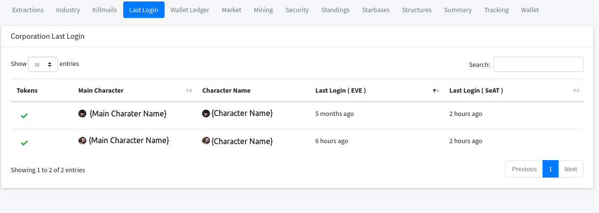

# Readme

## Seat User Last Login
This plugin will add a page to the corporation group, where you can Look at the seat accounts involved with the corporation,
and see when they last logged into Seat, and into EVE. This feature is locked behind the corporation.tracking role.

This plugin is aimed at identifying inactive players within your corporation, by showing:

 - The Main Character's Name (as Set in SeAT),
 - The most recent Logged in Character (as stored in 'character_onlines' table)
 - The most recent EVE Login Date
 - The last time the user logged into SeAT.

